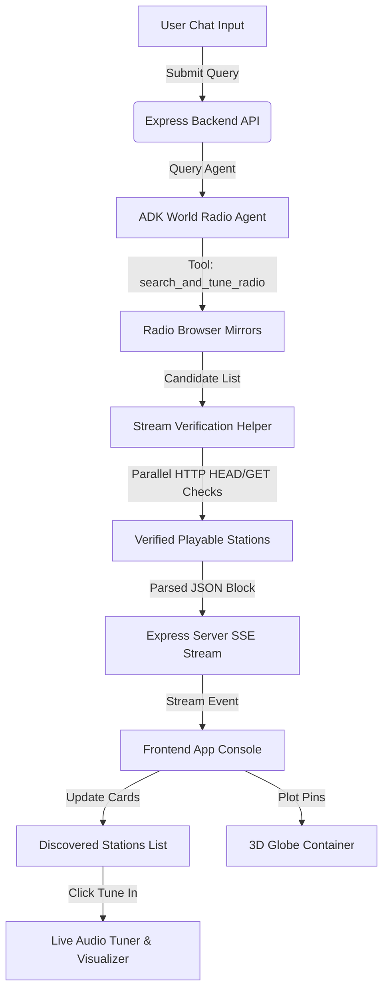

# 🌐 World Radio Finder & Tuner Console

Welcome to the **World Radio Finder & Tuner Console**, a futuristic, AI-driven dashboard for discovering and tuning into internet radio stations globally. The app features a stunning, interactive 3D WebGL globe backdrop and a fully functional audio player console with real-time waveform visualizers, all integrated with an intelligent AI Radio Agent that locates streams on request.

---

## ✨ Features

- **🗺️ Interactive 3D WebGL Globe**: Rotating backdrop built with `Globe.GL` that represents the earth. Discovered radio stations are plotted onto their correct geocoded latitudes and longitudes as clickable marker rings. Clicking a station or card triggers a smooth camera orbit to focus the globe on that coordinate.
- **🤖 Radio Finder Agent**: An AI assistant built using the **Google Agent Development Kit (ADK)**. You can ask it to find genres, artists, languages, or stations in specific cities/countries. Supported by Groq (`llama-3.3-70b-versatile`) and NVIDIA NIM (`meta/llama-3.3-70b-instruct`) with automatic fallback to Gemini (`gemini-2.5-flash`) on rate limits.
- **📻 Live Audio Tuner**: Fully interactive player console styled with a modern glassmorphic theme. Features play, pause, mute, and a volume slider.
- **🌊 HTML5 Canvas Visualizer**: Multi-layered sine-wave visualizer that performs real-time audio frequency analysis (via Web Audio API `AnalyserNode`) and falls back to smooth simulated wave motion if CORS policies restrict direct audio inspection.
- **⚡ HLS (.m3u8) Playback Support**: Dynamic live stream support powered by `hls.js` to play HTTP Live Streaming feeds directly in the browser.
- **🔒 CORS & Mixed-Content Stream Proxy**: Local NodeJS backend proxy to fetch streams, bypassing browser CORS issues and avoiding mixed-content warnings when serving HTTP streams on HTTPS.

---

## 🛠️ Tech Stack & Libraries

- **Frontend**: HTML5, Vanilla JavaScript, CSS3 variables, HSL color palettes, custom thin-scrollbar layouts.
- **3D Graphics**: [Globe.GL](https://globe.gl/) (WebGL/Three.js wrapper).
- **Audio Playback**: Native Audio element + [Hls.js](https://github.com/video-dev/hls.js).
- **Backend & API**: Node.js, Express, TypeScript (TSX execution).
- **AI Engine**: Google Agent Development Kit (ADK), Custom Groq SDK integrations.

---

## 🔄 Architectural Workflow

The application consists of three synchronized systems working together:



---

## ⚙️ Configuration

Create a `.env` file in the root directory:

```env
PORT=3000

# Provide at least one of these API keys:
GROQ_API_KEY=your_groq_api_key_here
NVIDIA_API_KEY=your_nvidia_api_key_here
GEMINI_API_KEY=your_gemini_api_key_here
```

*Note: The system supports an automatic fallback chain (Groq -> NVIDIA NIM -> Gemini) on rate limits, depending on which keys are configured.*

---

## 🚀 Installation & Running

### 1. Install Dependencies
```bash
npm install
```

### 2. Run in Development Mode
Starts the server with automatic compilation and watch via `tsx`:
```bash
npm run dev
```

### 3. Build & Start in Production Mode
```bash
npm run build
npm start
```
Access the application locally at: **`http://localhost:3000`**

---

## 📁 Directory Structure

```
├── public/                 # Static Frontend Files
│   ├── index.html          # Main HTML Dashboard Layout
│   ├── main.css            # Sleek Glassmorphic Styling
│   └── app.js              # Client-side Logic (Globe, Audio Player, SSE Client)
├── src/                    # Backend Source Files
│   ├── agent.ts            # ADK Agent Definition & Radio Search/Tune Tools
│   ├── server.ts           # Express App, SSE Endpoint, Audio Proxy, & Stream rewrite
│   └── test-agent.ts       # CLI Script to test the ADK Agent locally
├── package.json            # Configuration and commands
└── tsconfig.json           # TypeScript configuration compiler options
```
